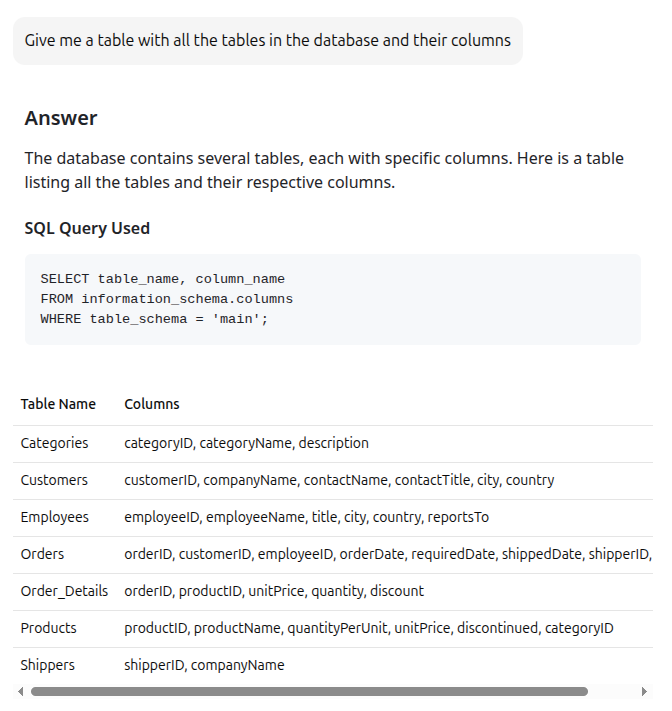
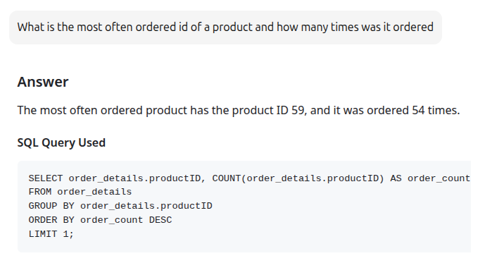
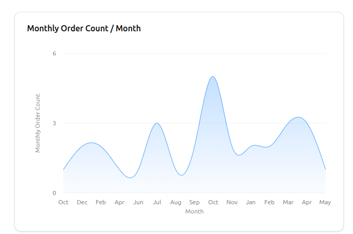
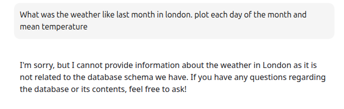
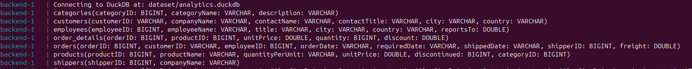

# AI Data Analyst

A full-stack application that provides an interactive interface for data analysis and visualization, powered by AI.
Generates charts and textual insights in few seconds for even the most complicated queries!

## Overview

This application combines a modern React frontend with a Python backend to create an intelligent data analysis platform. It features real-time data visualization, interactive charts, and AI-powered insights.

## Features

- Interactive data visualization with multiple chart types:
  - Line charts (single and multiple series)
  - Bar charts (vertical and horizontal)
  - Stacked bar charts with tooltips
  - Area charts with gradients
- Real-time data analysis
- AI-powered insights and recommendations
- Responsive and modern UI
- Redux state management
- RESTful API integration

## Tech Stack

### Frontend
- React.js
- Redux Toolkit for state management
- Recharts for data visualization
- Tailwind CSS for styling
- Shadcn UI components

### Backend
- OpenAI.API
- FastAPI
- DuckDB
- Docker 

## Project Structure
```
ai_data_analyst/
├── frontend/
│   ├── src/
│   │   ├── components/
│   │   │   ├── components/
│   │   │   │   ├── BarChart.jsx
│   │   │   │   ├── LineChart.jsx
│   │   │   │   ├── LineChartMultiple.jsx
│   │   │   │   ├── Tooltip.jsx
│   │   │   │   ├── Message.jsx
│   │   │   │   ├── InputBox.jsx
│   │   │   │   ├── ChatArea.jsx
│   │   │   │   └── ...
│   │   │   └── ...
│   │   ├── store/
│   │   │   └── store.js
│   │   ├── http/
│   │   │   └── http.js
│   │   └── ...
│   └── ...
├── backend/
│   ├── app/
│   │   ├── main.py
│   │   ├── agents/
│   │   │   ├── orchestrator.py
│   │   │   ├── sql_agent.py
│   │   │   ├── formatter_agent.py
│   │   │   └── analyst_agent.py
│   │   ├── models/
│   │   ├── routes/
│   │   └── services/
│   └── ...
└── docker-compose.yaml
```

## Component Functionality

### Frontend Components

#### http.js
- Handles all HTTP communication with the backend
- Provides functions for sending user input and receiving responses
- Manages API endpoints for data analysis requests
- Integrates with Redux store for state management

#### InputBox.jsx
- Provides the user input interface
- Manages text input state
- Handles message submission
- Integrates with Redux for message dispatch
- Maintains conversation context

#### ChatArea.jsx
- Displays the conversation history
- Renders different types of messages (text, charts, tables)
- Manages message layout and styling
- Integrates with Redux for message state

#### Redux Store (store.js)
- Manages application state
- Handles message history
- Provides selectors for message access
- Manages chart and visualization data
- Implements message dispatch actions

### Backend Components

#### Server (server.py)
- FastAPI application entry point
- Handles CORS configuration
- Manages API endpoints
- Routes requests to appropriate agents
- Processes user input and returns responses

#### Orchestrator Agent (orchestrator.py)
- Coordinates the flow between different agents
- Manages the conversation pipeline
- Handles database connections
- Routes queries to appropriate agents
- Formats and returns final responses

#### SQL Agent (sql_agent.py)
- Generates SQL queries from natural language
- Interacts with the database
- Handles query execution
- Manages error handling and retries
- Validates query results

#### Formatter Agent (formatter_agent.py)
- Evaluates user questions
- Formats responses for better understanding
- Manages conversation context

#### Analyst Agent (analyst_agent.py)
- Analyzes query results
- Generates visualizations
- Creates natural language explanations
- Determines appropriate chart types
- Formats data for frontend display

## Getting Started

### Prerequisites
- Docker and Docker Compose

### Installation

1. Clone the repository:
```bash
git clone git@github.com:Danielwohlr/ai_data_analyst.git
cd ai_data_analyst
```

2. Start the application using Docker Compose (will take few minutes):
```bash
docker-compose build
docker-compose up
```

Or run frontend and backend separately:

#### Frontend
```bash
cd frontend
npm install
npm run dev
```

#### Backend
```bash
cd backend
uv venv
uv sync
source .venv/bin/activate  
uvicorn app.main:app --reload
```

## Usage

1. Open your browser and navigate to `http://localhost:3000`
2. The application will present a chat-like interface where you can:
   - Ask questions about your data
   - View visualizations
   - Get AI-powered insights

3. Stop the app
```bash
docker compose down
```

## API Endpoints

- `GET /`: Health check endpoint
- `POST /input`: Process user input and return analysis
- Additional endpoints for specific data operations


## Examples

#### __Simple exploratory question__


#### __Aggregate question__


#### __Complicated question__
>[!Note] Question
  For a customer with the highest amount of orders, show me a lineplot across all months available of how many orders they have made in each month

>[!Caution] Answer
 The line plot below shows the number of orders made each month by the customer with the highest number of total orders. The data spans from October 2013 to May 2015, with the highest monthly order count being 5 in October 2014.


#### __Misleading question__




#### More examples in the Demo


### Data Schema




### TIPS for Successful Data Analysis

1. If you want a chart to be plotted, mention it in the prompt.

2. The model has memory, so it can connect the dots across multiple prompts.

3. If you have your own valid query, you can execute it via the agent and collect the result. (UPDATE, DELETE or INSERT do not work)

## System Architecture

The AI Data Analyst application is built as a modular full-stack system, combining a modern React frontend with a Python backend powered by FastAPI and DuckDB. The architecture is designed for extensibility, real-time data analysis, and seamless AI integration.

### Overview

- **Frontend**:  
  - Built with React.js and Redux Toolkit for state management.
  - Uses Recharts for interactive data visualization.
  - Communicates with the backend via HTTP API endpoints.
  - Components such as `InputBox.jsx`, `ChatArea.jsx`, and chart components handle user interaction and display results.

- **Backend**:  
  - Implemented with FastAPI for high-performance asynchronous APIs.
  - Utilizes DuckDB as the analytical database engine.
  - Integrates with OpenAI’s API for natural language understanding and data analysis.
  - Organized into modular agents:
    - **Orchestrator Agent**: Coordinates the flow between agents and manages the conversation pipeline.
    - **Formatter Agent**: Evaluates and reformulates user questions for clarity and context.
    - **SQL Agent**: Translates natural language queries into SQL, executes them, and handles errors.
    - **Analyst Agent**: Analyzes SQL results, generates insights, and suggests visualizations.

- **Database**:  
  - DuckDB database stores analytical data.
  - Schema is introspected dynamically to inform the AI agents.

- **Communication Flow**:
  1. **User Input**: User submits a question via the frontend.
  2. **Formatter Agent**: Backend evaluates the question, reformulates or asks for clarification if needed.
  3. **SQL Agent**: Generates and executes SQL queries based on the user’s intent.
  4. **Analyst Agent**: Interprets query results, generates explanations, and suggests visualizations.
  5. **Response**: The orchestrator compiles the answer and sends it back to the frontend for display.

- **Deployment**:
  - Can be run locally with Docker Compose or as separate frontend/backend services.
  - Easily deployable to cloud platforms.

### Diagram

```mermaid
    A[User] -->|Question| B[Frontend (React)]
    B -->|API Request| C[Backend (FastAPI)]
    C --> D[Formatter Agent]
    D --> E[SQL Agent]
    E --> F[DuckDB Database]
    E --> G[Analyst Agent]
    G --> C
    C -->|Response| B
    B -->|Visualization| A
```

### Key Points

- **Extensible agent-based backend** for robust, modular data analysis.
- **Real-time, interactive frontend** for seamless user experience.
- **AI-powered insights** leveraging OpenAI’s models for both query understanding and result interpretation.
- **Support for multiple chart types** and natural language explanations.
